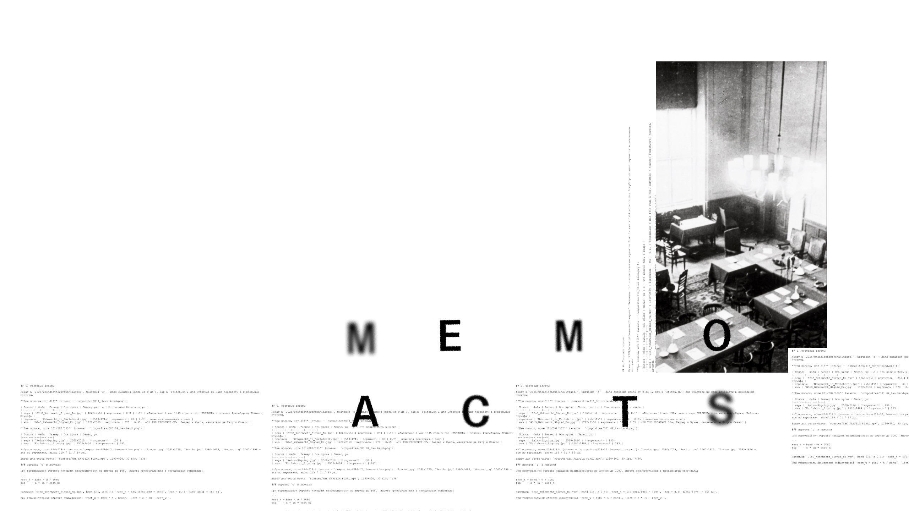
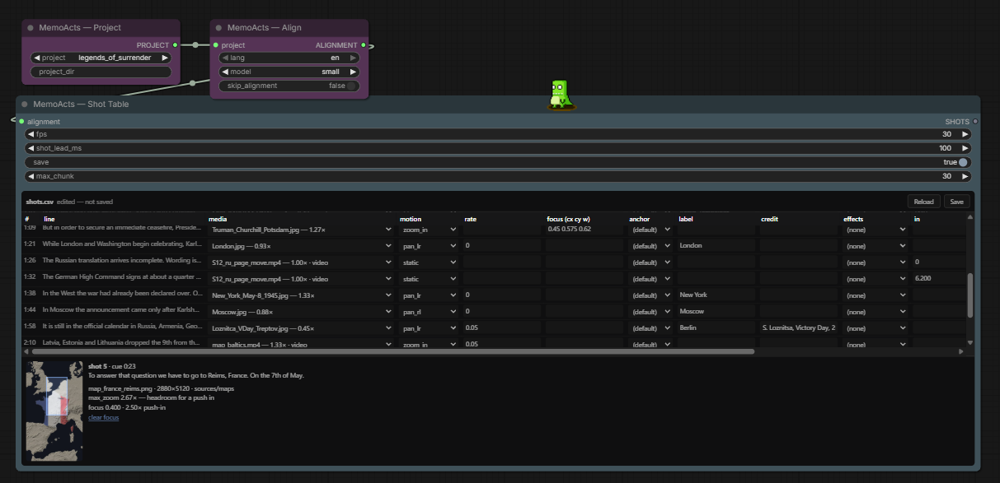

# MemoActStudio



A ComfyUI node pack for assembling vertical video from a script, a voice-over
recording and a set of still images.

The script is an input, not an output. The pack runs forced alignment to find
when each word of your script is spoken, then uses those timings for shot
boundaries and subtitles. It does not transcribe, so the burnt-in caption is
the text you wrote, character for character. That is the difference from
transcription-based subtitling, which can misread names, numbers and dates.



Developed for MemoActs, a documentary series and its production workshop.

---

## Features

- **Forced alignment** (stable-ts) of a known script against a recording, at
  word level. Falls back to proportional timing when alignment fails, and marks
  the affected shots.
- **Per-frame pan and zoom** computed in Python and streamed to ffmpeg. Memory
  use is constant in reel length.
- **Resolution guard.** A source that cannot fill the output frame is reported
  when it is selected, in the shot report, and again at render time, with the
  enlargement factor. It is never applied silently.
- **Subtitles** burnt in from `.ass` via libass, with an `.srt` sidecar, cut
  into single-line captions at word timings.
- **Six effect presets** — grade, grain, texture, frame overlay, shake,
  sharpen — each labelled with its measured render cost.
- **Video fragments** with in-point and playback speed, cropped to 9:16 or
  letterboxed.
- **Output:** MP4, H.264, 1080x1920, 30 fps, bitrate-capped, narration muxed
  without re-encoding. CPU only; no GPU and no generative model is used.

## Requirements

- ComfyUI
- Python 3.10 or later (ComfyUI's own interpreter)
- ffmpeg **built with libass**, on `PATH`
- `stable-ts`, `num2words`

## Installation

```
cd ComfyUI/custom_nodes
git clone https://github.com/aleglutz/MemoActStudio.git
```

Install the Python dependencies into ComfyUI's interpreter, not a system one:

```
python -m pip install stable-ts num2words
```

Verify that ffmpeg has libass. A build without it fails at render time rather
than at install time:

```
ffmpeg -filters | grep -w subtitles
```

Restart ComfyUI. The nodes appear in the `memoacts` category.

## Usage

Load `example_workflows/reel_stills.json` and select a project in the Project
node.

| Node | Function |
|---|---|
| **Project** | Reads the project directory and reports the recording, the images, and the media resolved for each shot |
| **Align** | Aligns the recording to the script. The only slow step; cached on the script and the recording |
| **Shot Table** | Applies `shots.csv` to the timings and emits the shot table. Contains the table editor |
| **Subtitles** | Caption style, and a preview of the cues that will be generated |
| **Render Reel** | Renders the MP4, with per-frame progress and preview |
| **Preview Shot** | Renders a single shot without audio or captions, for checking framing |

A project is a directory containing `script.md`, `shots.csv` and a `sources/`
directory holding the recording and the media. `projects/workshop_starter/` is
a minimal example; its `REBUILD.md` lists the files it expects.

`docs/WORKSHOP_HANDOUT.md` is a step-by-step walkthrough for a first-time user.

## Repository layout

| Path | Contents |
|---|---|
| `memoacts_core/` | The library: alignment, captioning, effects, motion, rendering, subtitles. No ComfyUI dependency |
| `nodes_*.py`, `web/` | The node pack and the shot-table widget |
| `tools/` | Command-line entry points to the same pipeline — see [`docs/CLI.md`](docs/CLI.md) |
| `projects/` | Project directories. Media is not versioned; each project's `REBUILD.md` documents how to regenerate it |
| `docs/` | [Handout](docs/WORKSHOP_HANDOUT.md), [shot table schema](docs/SHOTS_SCHEMA.md), [machine setup](docs/WORKSHOP_MACHINE_SETUP.md) |
| `SPEC.md` | Specification, and the reasoning behind each design decision |

## Known limitations

- Shot duration is derived from the narration and cannot be set directly. To
  change a shot's length, change the sentence it is cut to.
- Alignment requires a recording of the script being read. It cannot time a
  script that has not been recorded.
- English only; other languages are out of scope for this project (SPEC v3.1).
- The pack cannot be installed on Comfy Cloud, which supports a curated node
  list only.

## Licence

GPL-3.0-or-later, matching ComfyUI, whose API this pack imports. See `LICENSE`.

Not covered by it:

- **Media in `projects/`** is not part of this repository. Each project's
  `sources/SOURCES.md` records the origin and terms of its material.
- **`assets/fonts/`** — Share Tech Mono and Special Elite, under SIL OFL 1.1;
  the licence texts are in the same directory.
- **`assets/geo/`** — Natural Earth data, public domain; see
  `assets/geo/SOURCE.md`.
