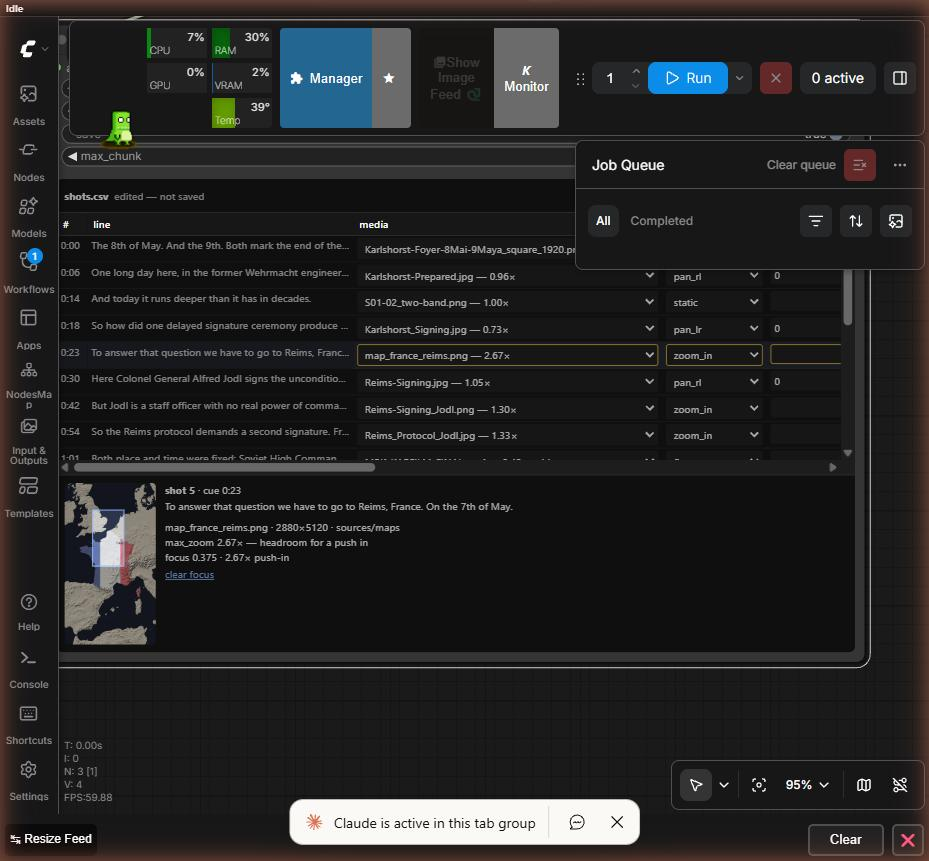

# MemoActStudio

**Cut a vertical reel to a voice-over, in ComfyUI.** You write the script, you
read it aloud, and the pack works out when each word lands. Nothing is
transcribed, so the caption on screen is the text you wrote — down to the
punctuation, and down to the dates.



It exists because the alternative — CapCut's auto-subtitle button — gets names
and dates wrong in historical material, and there is no way to tell it not to.
Here the script is ground truth and alignment computes timing only, which is a
different operation with a different failure mode: it can be late, it cannot be
wrong about what you said.

Built for **MemoActs** — a documentary series on how wars end, and the workshop
that teaches making it.

---

## What it does

- **Timings from your own text.** Forced alignment (stable-ts) against the
  script you wrote. Word-level, so captions are cut at real word boundaries.
- **Ken Burns that knows its limits.** Pan and zoom computed per frame, and a
  resolution guard that refuses to enlarge a photograph quietly. Every picture
  shows how much room it has *before* you choose it.
- **One table for the edit.** Which picture, which move, what the shot is about,
  what it is called, what it costs. Twenty rows, edited in the node or in a text
  editor — the same file either way.
- **Subtitles that are files.** `.ass` burnt in by libass, `.srt` beside it.
  Unlimited, free, and identical to what the preview showed you.
- **Effects with a price tag.** Six looks, each labelled with what it costs in
  render time, because on a shared machine that is the decision.
- **Nothing generated.** No model invents a picture, writes a line or fills a
  gap. CPU only; no GPU required.

## Install

```
cd ComfyUI/custom_nodes
git clone https://github.com/aleglutz/MemoActStudio.git
```

Then, into **ComfyUI's own Python** — not a system one:

```
python -m pip install stable-ts num2words
```

You also need **ffmpeg built with libass** on `PATH`. Check before you rely on
it, because a build without it fails at render time rather than at install time:

```
ffmpeg -filters | grep -w subtitles
```

Restart ComfyUI. The nodes appear under **memoacts**.

## Use it

Open `example_workflows/reel_stills.json`. Six nodes, left to right, and each is
one sentence:

| | |
|---|---|
| **Project** | this is my material |
| **Align** | my words become timings |
| **Shot Table** | I decide what is seen |
| **Subtitles** | the words become captions |
| **Render Reel** | the reel is made |
| *Preview Shot* | *one shot, in seconds — use this twenty times before rendering once* |

A project is a folder: `script.md`, `shots.csv`, and a `sources/` folder holding
the recording and the pictures. `projects/workshop_starter/` is a short one to
start from, and its `REBUILD.md` says exactly what to put in it.

**[The workshop handout](docs/WORKSHOP_HANDOUT.md) is the full walkthrough** —
written for someone at the machine, with no command in it.

## Where things are

| | |
|---|---|
| `memoacts_core/` | the machinery — align, caption, effects, motion, render, subtitles. No ComfyUI import anywhere in it |
| `nodes_*.py`, `web/` | the node pack and the shot-table widget |
| `tools/` | the same pipeline from the command line — the reference implementation ([how to run it](docs/CLI.md)) |
| `projects/` | the reels. `legends_of_surrender` is a finished 168 s one; its media is not versioned, and `REBUILD.md` regenerates every frame of it |
| `docs/` | [handout](docs/WORKSHOP_HANDOUT.md), [shot table schema](docs/SHOTS_SCHEMA.md), [machine setup](docs/WORKSHOP_MACHINE_SETUP.md) |
| `SPEC.md` | what this is meant to be, and why each decision went the way it did |

## Two things it will not do

**It will not upscale silently.** A picture smaller than the frame is reported
when you pick it, again in the shot report, and again at render time. Then it
does the best it can and says by how much.

**It will not give you a timeline.** Shot length comes from the narration,
because the narration is what the audience is following. To make a shot longer,
say more.

## Licence

**GPL-3.0-or-later** — the same licence ComfyUI itself carries, which is the
point: this pack imports ComfyUI's API, and a reel-cutting tool paid for by a
public grant should stay open for whoever picks it up next.

Media inside `projects/` is **not** covered: it is not in this repository, and
each project's `sources/SOURCES.md` records where its pictures came from and
under what terms. The bundled font (`assets/fonts/`) is SIL OFL 1.1 and carries
its own licence; the map data in `assets/geo/` names its source in
`assets/geo/SOURCE.md`.
