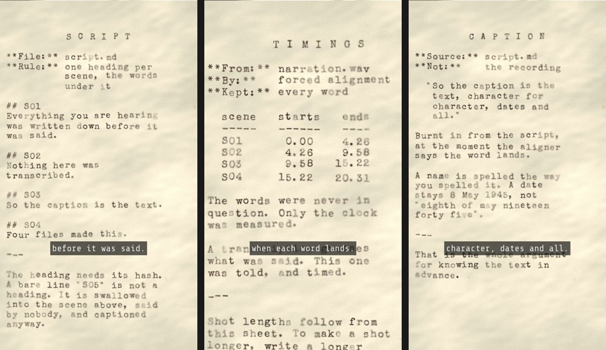

# MemoActStudio

A ComfyUI node pack that assembles vertical video from a script, a voice
recording and still images.



**The script is an input, not an output.** The pack runs forced alignment to
find when each word of your script is spoken, and uses those timings for shot
boundaries and subtitles. It does not transcribe, so the burnt-in caption is
the text you wrote, character for character — which is the difference from
transcription-based subtitling, and it shows on exactly the words that matter:
names, numbers and dates.

Developed for MemoActs, a documentary series and its production workshop. The
frames above are `projects/first_reel`, which is in this repository and which
the walkthrough below renders.

---

## Install

**1. Clone into `custom_nodes/`:**

```
cd ComfyUI\custom_nodes
git clone https://github.com/aleglutz/MemoActStudio.git
```

**2. Install the dependencies into the Python ComfyUI runs on.** On a portable
or Easy-Install ComfyUI that is the embedded interpreter, *not* whatever
`python` means in your shell — installing into the wrong one is the most
common way to end up with a pack that does not load:

```
<ComfyUI-Easy-Install>\python_embeded\python.exe -m pip install -r ComfyUI\custom_nodes\MemoActStudio\requirements.txt
```

Four packages: `stable-ts` (alignment), `num2words`, `pedalboard` and
`pyloudnorm` (the voice graph). `pedalboard` is a compiled wheel — if none
exists for your Python, everything except the seven voice nodes still works,
because nothing else imports it.

**3. ffmpeg must be on `PATH` and built with libass**, or subtitles fail at
render time rather than at install time:

```
ffmpeg -filters | findstr subtitles
```

You want a line mentioning **libass**. No line at all means a build that cannot
burn captions in.

**4. Restart ComfyUI.** The nodes appear under `memoacts` in the node menu, and
a **Storyline** tab appears in the sidebar.

## Your first reel

`projects/first_reel` ships with this repository — four scenes, twenty
seconds, its pictures and its narration included. Everything below is about
that project, and it is the fastest way to find out whether your install works.

**1. Open `example_workflows/reel_stills.json`** (ComfyUI's Workflow → Open).
The project widget already says `first_reel`. Press **Run**.

That is the whole reel: five nodes, left to right, each one a sentence.

| | Node | What it does |
|---|---|---|
| 1 | **Project** | Reads the folder and reports it: the recording and its length, the images, which media each scene resolved to, and every warning worth having before a render |
| 2 | **Align** | Aligns the recording against the script, at word level. The only slow step — about 90 s the first time, then cached on the script and the recording |
| 3 | **Shot Table** | Applies `shots.csv` to those timings and writes `generated/shots.json`. Prints the shot report |
| 4 | **Subtitles** | Caption style, and a preview of the exact cues that will be burnt in |
| 5 | **Render Reel** | Renders the MP4, with per-frame progress |

A sixth node, **Preview Shot**, renders one scene without audio or captions —
for checking a framing without paying for the whole reel.

Expect: 4 shots, 609 frames, 20.300 s of video against 20.309 s of narration,
12 subtitle cues, and no enlargement warnings.

**2. Open the Storyline tab in the sidebar.** This is where the edit happens —
not in the graph. Scenes stack in the order they are spoken, each with a
duration bar; the pictures are a shelf above them. **Click a scene, then click
a picture.** It writes `shots.csv`, which is the file the graph reads. Press
Run again to see it.

**3. Open `example_workflows/voice.json`** to see where a recording comes from.
Load Audio → Pitch / Time → Speech Denoise → De-esser → Vocal Compressor →
Normalize → Loudness Meter → **Set Narration**, which makes the project if the
name is new and writes `sources/narration.wav`. Decide the pace here: every
timing in the reel is measured against what this graph produced, so speeding
the voice up afterwards invalidates all of them.

## Your own project

A project is a folder under `projects/`, and it is four files:

```
projects/<name>/
  script.md      the words — ground truth, never transcribed
  shots.csv      the edit: what is seen
  sfx.csv        the sound design (optional)
  sources/       narration.wav, images/, videos/, composites/, maps/
  generated/     shots.json, report.txt — deletable, remade on every Run
  out/           the reel
```

You do not have to make it by hand: type a new name into **Set Narration** and
it creates the folder tree and puts the voice in it.

### `script.md`

Scene headings and the words under them. Nothing else:

```markdown
## S01
The 8th of May. And the 9th.

## S02
One long day here opened a fork that still runs across Europe.

## S03
```

- **The heading needs its `#`.** A bare line `S05` is not a heading: it is
  swallowed into the previous scene, spoken by nobody, and burnt into that
  scene's caption. An editor that escapes the hashes on paste (`\## S01`) turns
  every heading off at once — the Project node counts them and says so, because
  this failure looks like nothing until you count the scenes.
- **A heading with no text under it is a silent scene**, and legal: it holds
  screen time that alignment fills from the pause between its neighbours.
- Timecoded scripts (`**0:00** —` in front of each block) are also read. That
  is the author's older dialect; headings are what the workshop teaches.

### `shots.csv`

One row per scene you want to say something about. Every column but `shot` is
optional, a blank cell means "keep the default", and a row starting with `#` is
a comment. Thirteen columns, and the full grammar of each is in
[`memoacts_core/shotlist.py`](memoacts_core/shotlist.py):

| Column | Means |
|---|---|
| `shot` | Which scene: the number (1-based, as the report numbers them) or the cue timecode written in the script |
| `media` | The filename, looked for in `images/`, `composites/`, `maps/`, `videos/` in that order |
| `in` | Footage only: where in the fragment this shot starts |
| `motion` | `static · zoom_in · zoom_out · pan_lr · pan_rl · pan_ud · pan_du · square_in · fit` |
| `rate` | How much the frame breathes, as a fraction across the shot. 0.04–0.08 reads as a slow drift |
| `anchor` | `center` or `top` |
| `speed` | Footage only: playback rate. 0.4 is slow motion |
| `focus` | What the shot is *about*: `cx cy w` as fractions of the source — a point and how much of the width to end on. `static`, `zoom_in` and `zoom_out` honour it; the pans ignore it |
| `path` | Several stops instead of one: `t:cx,cy[,w]` per stop. A shot that *reads* something |
| `label` | A tag burnt into the top-right corner for a few seconds — a place or a person the narration does not name |
| `credit` | The source credit for this shot |
| `effects` | A preset from `effects.PRESETS`, for this shot only |
| `notes` | For you. Nothing reads it |

Shot duration is not a column, and cannot be: it comes from the narration. To
make a shot longer, write a longer sentence.

**The resolution guard.** A crop window is inside the picture and cannot leave
it, so a source too small to fill a 1080-wide frame is reported when you choose
it in the panel, again in the shot report, and again at render time, with the
enlargement factor. `on_upscale` decides whether that warns, refuses or passes
quietly. It is never applied silently.

## The nodes

35 of them, in four categories. The five above are the spine; the rest are
opened when you need them:

| Category | What is in it |
|---|---|
| `memoacts` | The reel (9) and the sound design (4) |
| `memoacts/audio` | The voice: Pitch / Time, De-esser, Vocal Compressor, Normalize, Speech Denoise, Auto-Tune, Loudness Meter |
| `memoacts/effects` | Grade, grain, texture, frame overlay, shake, sharpen, and the preset that sets them |
| `memoacts/page` | Typing a document of your own onto paper, for a reel that needs a sheet nobody scanned |

**[`docs/NODES.html`](docs/NODES.html) is the full reference** — every node,
every parameter, its default and its range, read off a running server. Open it
in a browser.

## When it stops

| What you see | What it is |
|---|---|
| `no narration.* in …` | The project has no recording. That is `voice.json`, ending in Set Narration |
| `script.md has no shots` | No scene headings, or they are escaped — see the trap above |
| `shots.csv is open in LibreOffice` (or `in another program`) | A spreadsheet is holding the file. Close it; the pack refuses rather than half-writing your edit |
| `source supplies only N px for a 1080px output` | The picture is smaller than the frame. It still renders; `on_upscale` decides how loudly |
| Subtitles missing from the MP4 | ffmpeg without libass. See the install check |
| `PIL.UnidentifiedImageError` in the console after a render | Not ours, and harmless: the frontend asks for a webp thumbnail of an `.mp4`. ComfyUI's own video nodes do it too |

## Known limitations

- Shot duration is derived from the narration and cannot be set directly.
- Alignment needs a recording of the script being read. It cannot time a script
  that has not been recorded.
- English only; other languages are out of scope for this project (SPEC v3.1).
- The pack cannot be installed on Comfy Cloud, which supports a curated node
  list only.
- Output is fixed at 1080×1920, 30 fps, H.264, narration muxed without
  re-encoding. CPU only — no GPU and no generative model is used to make a reel.

## Repository layout

| Path | Contents |
|---|---|
| `memoacts_core/` | The library: alignment, captioning, effects, motion, page, rendering, subtitles, voice. No ComfyUI dependency, no torch |
| `nodes_*.py`, `web/` | The node pack and the Storyline panel |
| `tools/` | Command-line entry points onto the same `memoacts_core.pipeline` functions the nodes call. The author's path, and the reference implementation of every step — see [`docs/CLI.md`](docs/CLI.md) (written for macOS) |
| `example_workflows/` | `voice.json`, `reel_stills.json`, `sound_design.json`, `hook_page.json` |
| `projects/first_reel/` | The example above, media included |
| `docs/` | [Node reference](docs/NODES.html), [handout](docs/WORKSHOP_HANDOUT.md), [shot table schema](docs/SHOTS_SCHEMA.md), [sound design](docs/SOUND_DESIGN.md), [machine setup](docs/WORKSHOP_MACHINE_SETUP.md) |
| `docs/SPEC.md` | The specification, and the reasoning behind each decision |

## Licence

GPL-3.0-or-later, matching ComfyUI, whose API this pack imports, and pedalboard,
which the voice nodes import. See `LICENSE`.

Not covered by it:

- **Media in `projects/`** is not part of this repository, with one exception:
  `projects/first_reel/sources/` is in git so the walkthrough above can be run.
  Its pictures were drawn by this pack and its narration synthesised with
  Kokoro (Apache-2.0); `projects/first_reel/sources/SOURCES.md` says so. Every
  other project's `SOURCES.md` records the origin and terms of its material.
- **`assets/fonts/`** — Share Tech Mono (SIL OFL 1.1), Special Elite
  (Apache-2.0) and Erika Ormig (CC BY-ND 4.0); the licences are in the same
  directory, and the third one forbids modifying the font file.
- **`assets/geo/`** — Natural Earth data, public domain; see
  `assets/geo/SOURCE.md`.
